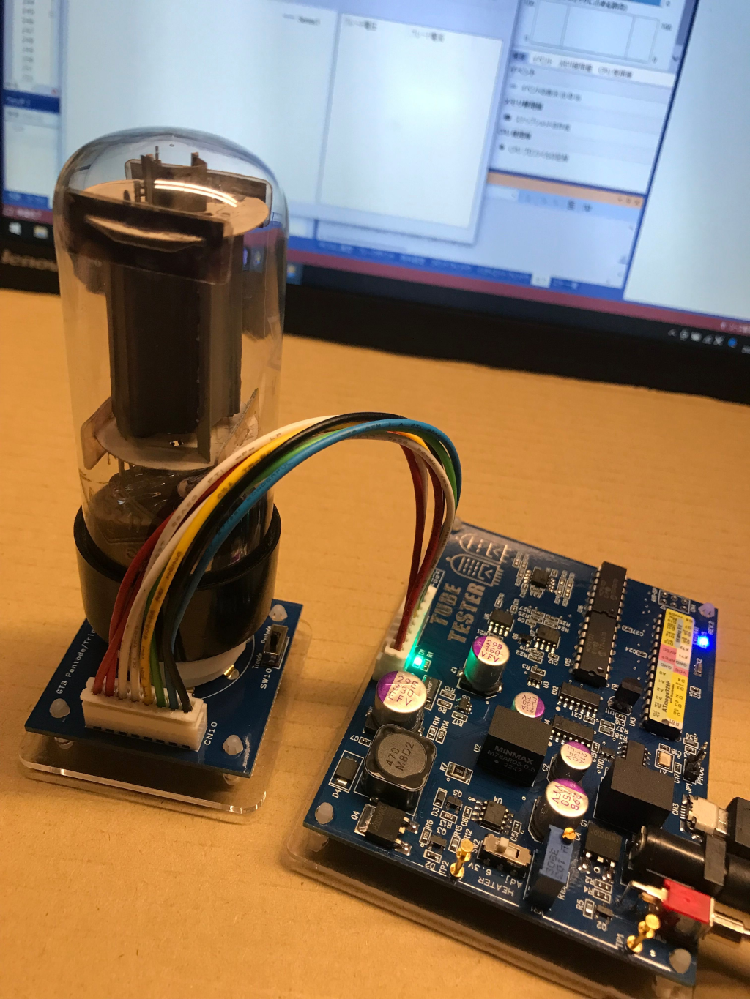
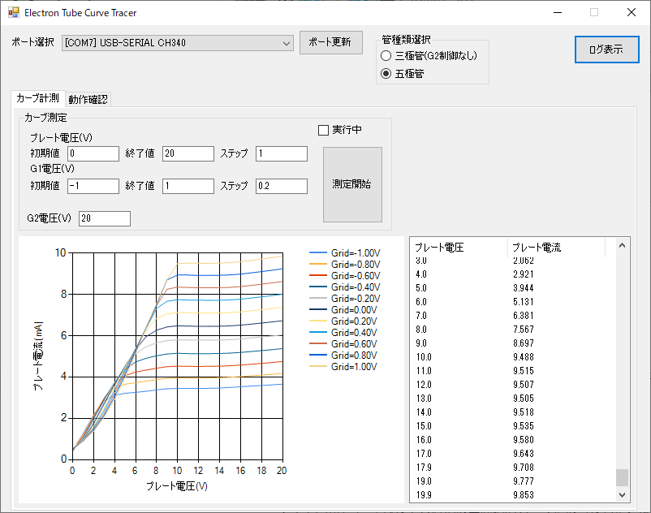

# 真空管用特性計測基板 TubeTester

## 概要

真空管のプレート電圧・グリッド電圧-プレート電流伝達特性を自動で計測します。
計測範囲は以下のとおりです

| 計測（設定）値 | 範囲 |
| ------- | --- |
| プレート電圧 | 0V～20V |
| グリッド電圧 | -1V～1V |
| スクリーングリッド電圧（5極管） | 0V～20V |
| プレート電流 | 0mA～20mA |
| ヒータ電圧 | 1.25V～13V（標準6.3V） |
| ヒータ電流 | 0A～1.5A |

## PC用計測ソフト

PC用計測ソフトはWindows10で動作します。
Windows11でもたぶん動きますが未検証です。

### プログラムのダウンロード

プログラムは[ここ](https://github.com/tceoo1/TubeTester/CurveTracer.zip)からダウンロードできます

## くわしい使い方

[ドキュメントフォルダ](https://github.com/tceoo1/TubeTester/doc)に各種ドキュメントがあります。